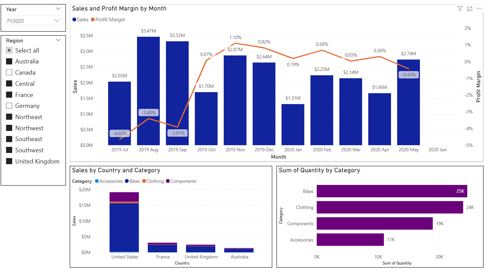
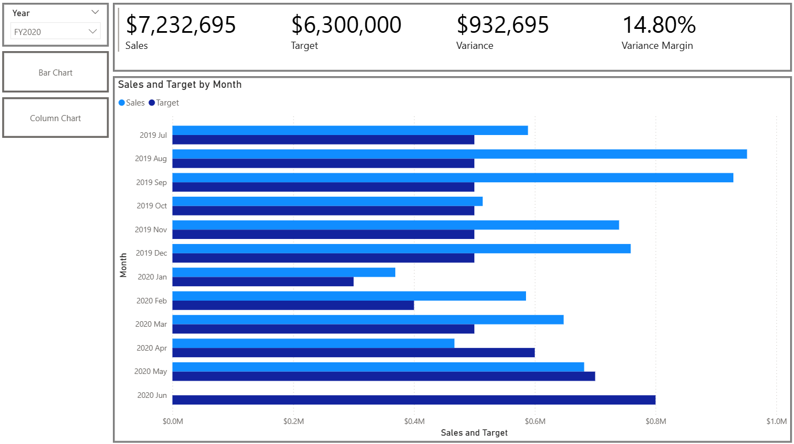
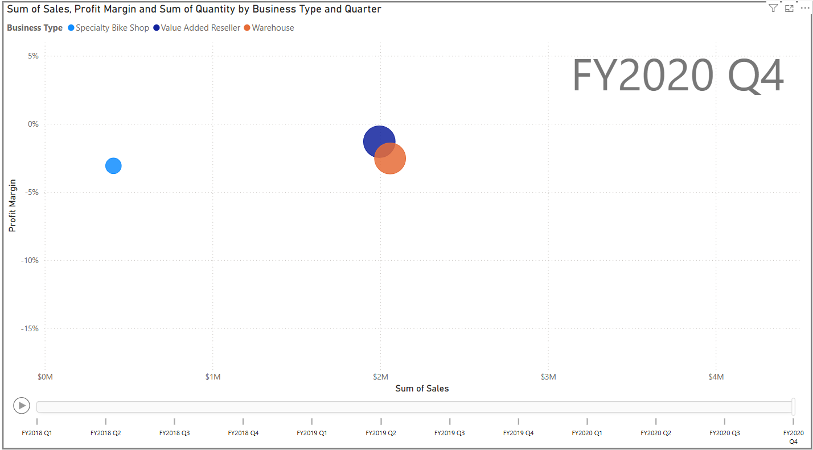

This Power BI report presents an interactive sales and performance analysis built using the AdventureWorks sample database. The goal of the report is to provide clear insights into sales trends, profitability, targets, and business performance across time, regions, and product categories.

**Key Highlights**

**Sales & Profit Margin Analysis**
Monthly sales trends combined with profit margin performance allow easy identification of high- and low-performing periods.

**Sales vs Target Tracking**
Comparison of actual sales against targets with KPI indicators for total sales, variance, and variance margin.

**Geographical & Category Insights**
Sales breakdown by country and product category, along with quantity analysis to understand demand distribution.

**Interactive Scatter Analysis Over Time**
A dynamic scatter visual showing sales vs. profit margin, with bubble size representing quantity.
The chart is animated by quarter, allowing users to play through time and observe how each business type’s performance evolves quarter by quarter.

**Interactive Filtering**
Slicers for year and region enable dynamic exploration of the data.

**Dataset**

Built using the AdventureWorks sample database, a Microsoft-provided dataset for learning, demonstrations, and portfolio projects.

**Purpose**

Portfolio and learning project. Demonstrates skills in Power BI report design, data modeling, DAX, and interactive storytelling.

**Usage Notes**

Open the .pbix file in Power BI Desktop to fully experience the interactive visuals, including the time-based scatter animation.

Screenshots are included to preview key dashboards and visuals.

## Dashboard Preview

### Sales & Profit Overview

### Sales vs Target

### Business Performance by Type and Quarter

