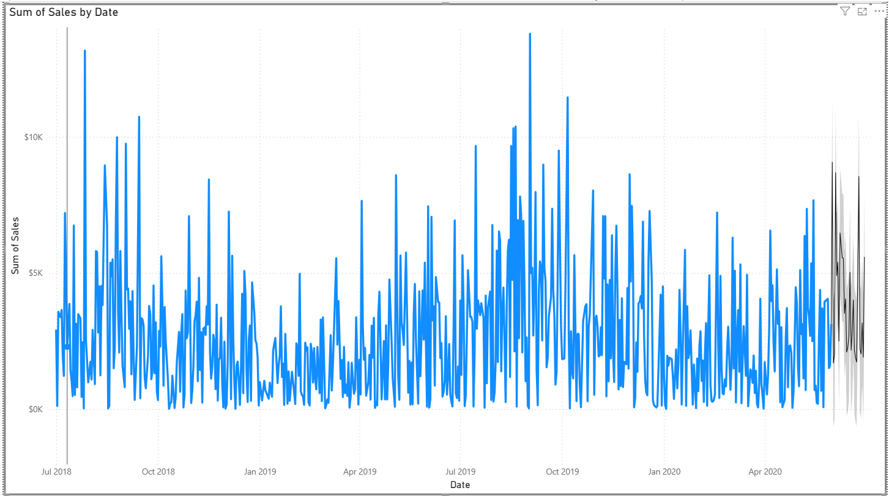

### Sales Analysis in Power BI

**This Power BI report presents an interactive sales and performance analysis built using the AdventureWorks sample database. The goal of the report is to provide clear insights into sales trends, profitability, targets, and business performance across time, regions, and product categories.**

**Key Highlights**

**Sales & Profit Margin Analysis:**
Monthly sales trends combined with profit margin performance allow easy identification of high- and low-performing periods.

**Geographical & Category Insights:**
Sales breakdown by country and product category, along with quantity analysis to understand demand distribution.

**Sales vs Target Tracking:**
Comparison of actual sales against targets with KPI indicators for total sales, variance, and variance margin.

**Interactive Scatter Analysis Over Time:**
A dynamic scatter plot visualizes sales versus profit margin, with bubble size representing quantity. The chart is animated by quarter, allowing users to observe how each business type’s performance evolves.

**Sales Forecasting:**
Forecasting is added directly to the sales time series chart to predict future sales based on historical trends.

Users can adjust the forecast length and confidence intervals to gain predictive insights.

**Interactive Filtering**
Slicers for year and region enable dynamic exploration of the data.

**Dataset**

Built using the AdventureWorks sample database, a Microsoft-provided dataset for learning, demonstrations, and portfolio projects.

**Purpose**

Portfolio and learning project demonstrating skills in Power BI report design, data modeling, DAX, and interactive storytelling.

## Dashboard Preview

### Sales & Profit Overview

### Sales vs Target

### Business Performance by Type and Quarter

### Forecast visual showing predicted sales trends beyond historical data.

