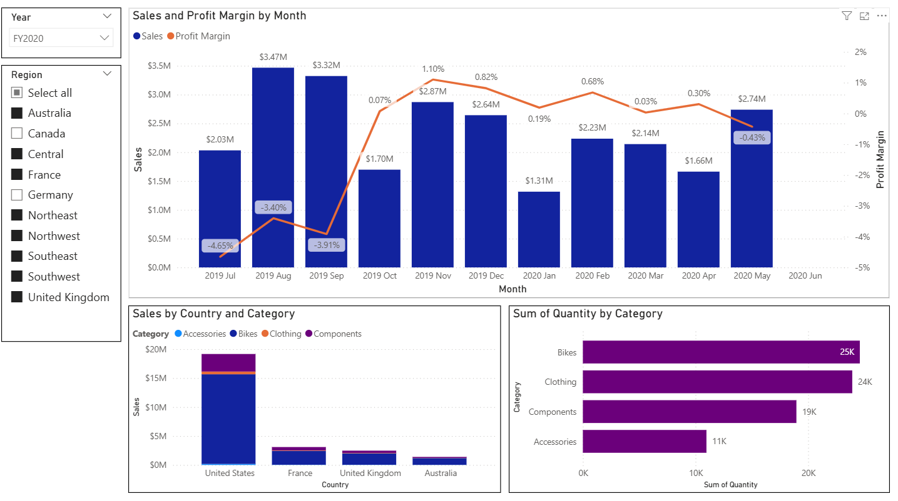
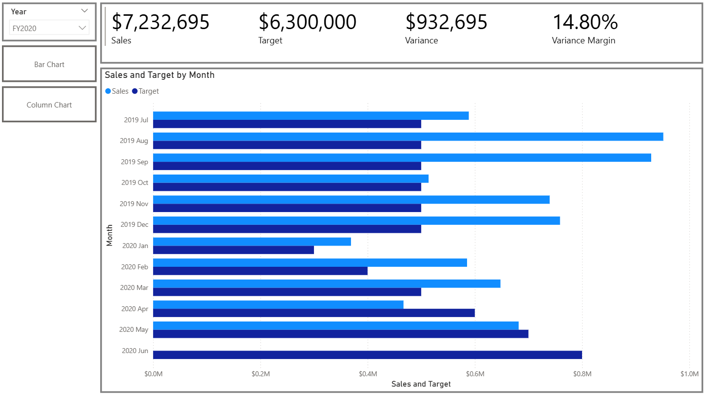
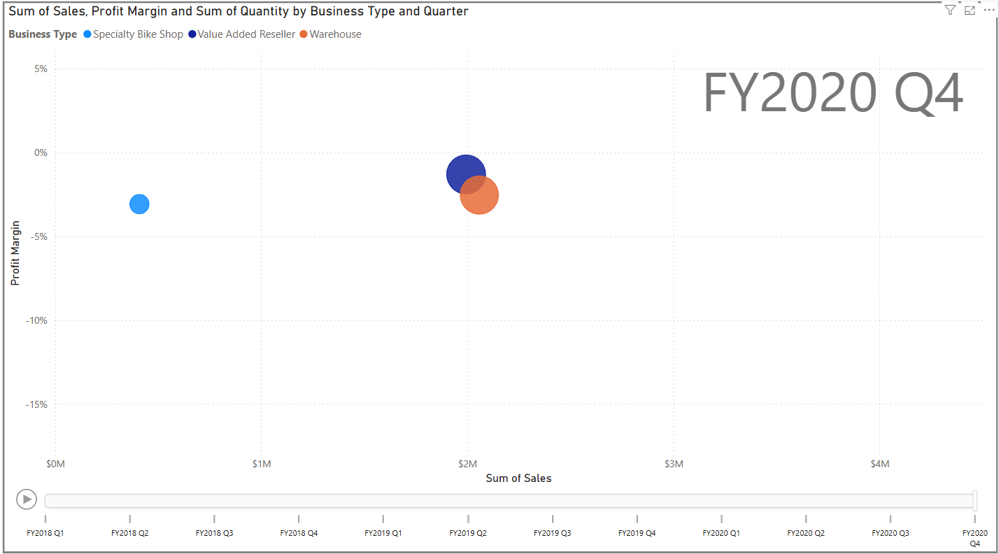
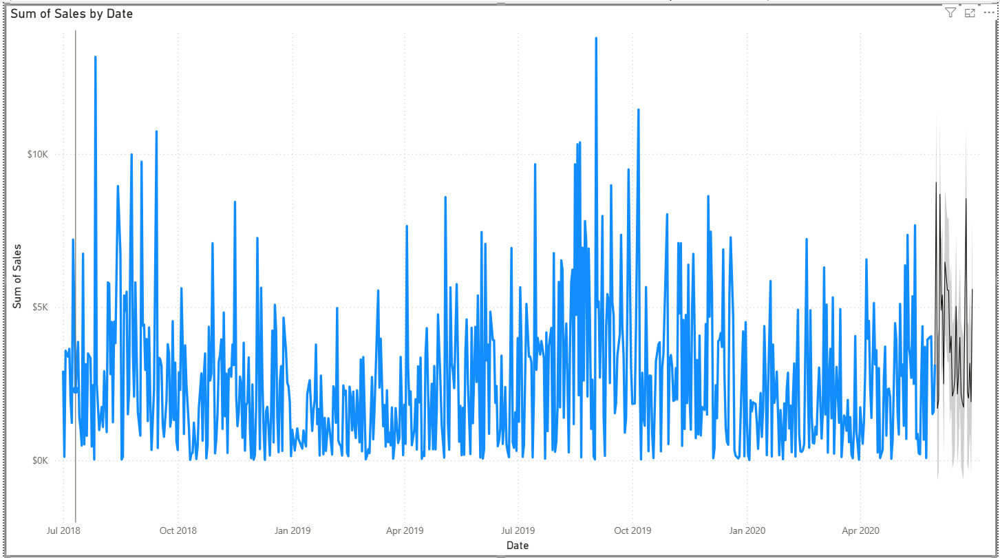
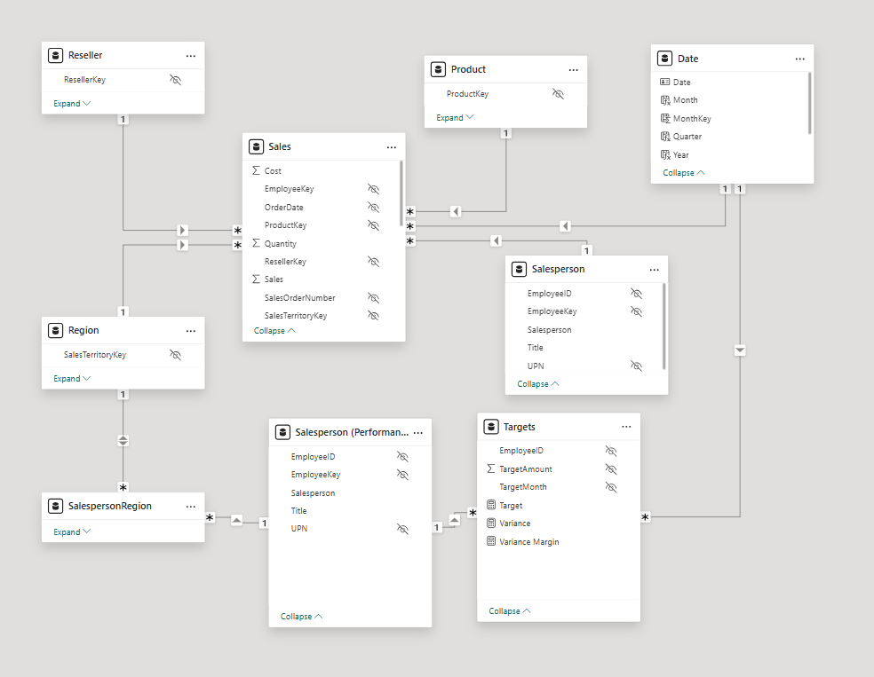

# Sales Analysis in Power BI

An interactive sales and performance analysis report built in **Power BI** using the AdventureWorks sample database, providing insights into sales trends, profitability, targets, and business performance across time, regions, and product categories.

---

## Note on Access

This report requires a Power BI Pro license to share interactively. Dashboard screenshots below show the full report functionality.

---

## Key Features

| Feature | Description |
|---|---|
| Sales & Profit Margin Analysis | Monthly sales trends combined with profit margin performance to identify high- and low-performing periods |
| Geographical & Category Insights | Sales breakdown by country and product category with quantity analysis |
| Sales vs Target Tracking | Actual sales compared against targets with KPI indicators for total sales, variance, and variance margin |
| Interactive Scatter Analysis | Dynamic scatter plot of sales vs profit margin animated by quarter, with bubble size representing quantity |
| Sales Forecasting | Forecast overlay on the sales time series with adjustable forecast length and confidence intervals |
| Interactive Filtering | Slicers for year and region for dynamic data exploration |

---

## Dataset

Built using the **AdventureWorks** sample database — a Microsoft-provided dataset used for learning, demonstrations, and portfolio projects.

---

## Dashboard Preview

### Sales & Profit Overview

### Sales vs Target

### Business Performance by Type and Quarter

### Sales Forecast

### Data Model

---

## Technologies Used

| Tool | Purpose |
|---|---|
| Power BI | Report design and interactive dashboards |
| DAX | Calculated measures and KPIs |
| AdventureWorks | Sample dataset |
